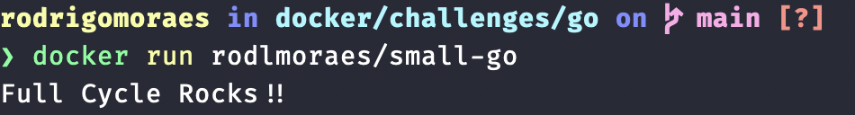
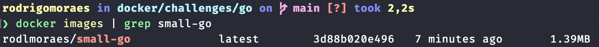

# Golang Minimal Image

The idea of this challenge is to build a golang docker image with less than 2MB.
The proposed image is basically a "Hello world", it just prints "Full Cycle Rocks!!" and that's all.


Docker Hub image: https://hub.docker.com/r/rodlmoraes/small-go

You can run it with the following command:
```docker run rodlmoraes/small-go```

You can also check it's size, after having pulled the image, with the following command:
```docker images | grep small-go```


## References
 - https://github.com/leoviana00/golang-minimal-image/tree/main
 - https://medium.com/@pavelfokin/how-to-build-a-minimal-golang-docker-image-b4a1e51b03c8
 - https://klotzandrew.com/blog/smallest-golang-docker-image/
